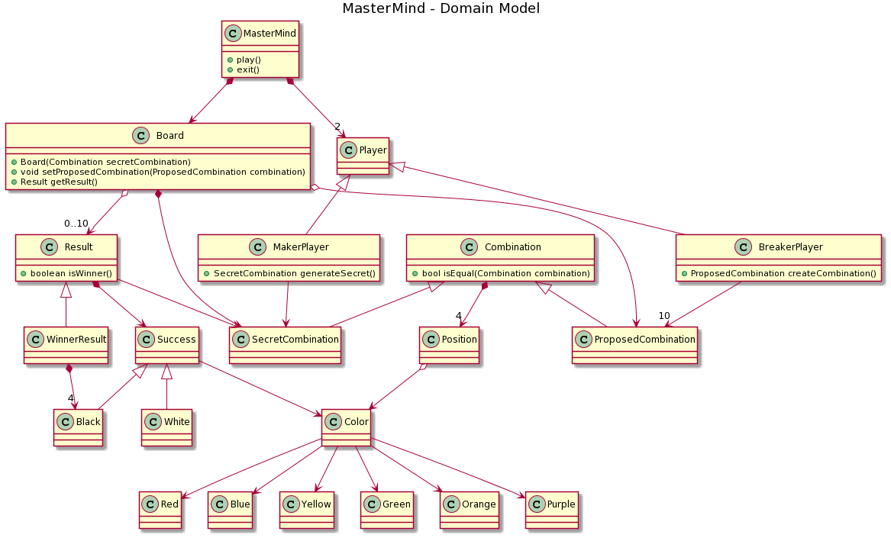

MasterMind: Modelo del dominio - Vistas pública
----
### Domain Model

### Public View

# ProgramacionOO Ejercicio2
# Vista pública de las clases del juego Mastermind

Realizar en un diagrama UML la vista pública de las clases del juego Mastermind.

Para ello vamos a partir del **diagrama de clases propuesto por Luis**, que está en la hoja de requisitos del juego Mastermind. Esa Hoja de requisitos de ha adjuntado como **PDF en la carpeta "docs"** de este repositorio.

Ten en cuenta que el diagrama de clases es del modelo del dominio, pero en el diseño quizás todas las clases que aparecen en ese diagrama no van a convertirse en clases del software que se va a desarrollar. Escoger las clases que van a formar parte finalmente del programa es decisión tuya, en función de tu sentido común y, lógicamente, de los requisitos de tu cliente.

La vista pública incluye las clases y los métodos que tendrán esas clases, que se tendrán que incluir en el diagrama UML. Generalmente no se incluyen los atributos, puesto que muchas veces se sobreentiende y muchos de ellos son otras clases del programa, que están relacionadas en el propio diagrama UML. De todos modos, estos detalles los explicó Luis en la [Tutoría 2](https://escuela.it/cursos/programacion-orientada-a-objetos/clase/tutoria-vista-publica). 

Hemos creado un momento (ver el listado de momentos en el desplegable) que os llevará directamente al momento en el que se explica el enunciado de esta práctica. El momento se llama "Enunciado ejercicio propuesto". 

En esta tutoría también se mostró muy rápidamente la sintaxis en PlantUML de la definción de métodos. Lo vimos usando PlantText.
